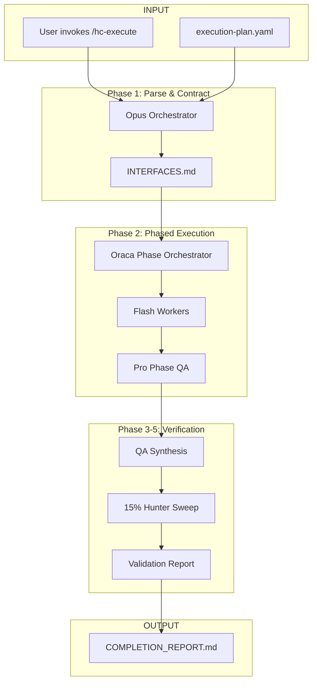

# Execution

**Oraca-orchestrated execution with QA gates and 15% Hunter sweep.**

---

## Recent Executions

| Date | Execution | Status |
|------|-----------|--------|
| 2026-01-04 | [Think-Tank Improvements](think_tank_improvements_20260104/index.md) | Complete |
| 2026-01-04 | [Gauntlet Integration](gauntlet_integration_20260104/index.md) | Complete |
| 2026-01-03 | [Diffusion Framework](diffusion_framework_20260103/index.md) | Complete |

---

## How `/hc-execute` Works

---

## Execution Phases

| Phase | Agent | Purpose |
|-------|-------|---------|
| **1. Parse & Contract** | Opus | Batch tasks, define interfaces |
| **2. Phased Execution** | Oraca + Flash | Execute tasks in parallel |
| **3. QA Synthesis** | Pro | Validate all deliverables |
| **4. 15% Hunter** | Pro | Find missed tasks, edge cases |
| **5. Validation** | Opus | Final report |

---

!!! tip "Running Executions"
    Run `/hc-execute` after approving a think-tank plan.
