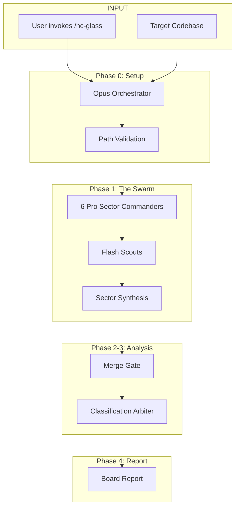

# G.L.A.S.S.

**Global Logic & Architecture System Scan**

Trust nothing. Verify everything. Cite line numbers or it didn't happen.

---

## Recent Audits

| Date | Audit | Sectors |
|------|-------|---------|
| 2026-01-04 | [Deep Audit](deep_audit_20260104/index.md) | 6 sectors |

---

## How `/hc-glass` Works

---

## Sector Commanders

| Sector | Commander | Focus |
|--------|-----------|-------|
| **1** | Archaeologists | Git history, decision trails, zombie code |
| **2** | Plumbers | Data flow, context propagation, pipelines |
| **3** | Critics | Code smells, anti-patterns, complexity |
| **4** | Janitors | Dead code, unused imports, cruft |
| **5** | Guards | Security, edge cases, vulnerabilities |
| **6** | Registrars | Doc-code alignment, SSoT drift |

---

!!! tip "Running Audits"
    Run `/hc-glass` to deploy sector commanders.
