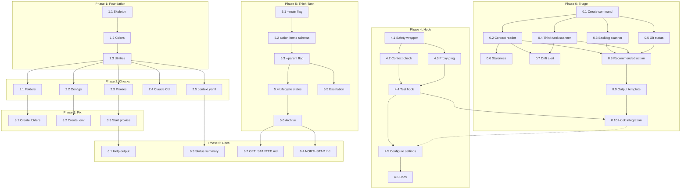

# Shared Interfaces & Contracts

**Plan:** hc_init
**Session:** hc_init_20260102
**Generated:** 2026-01-02

---

## 1. File System Contracts

### Required Folder Structure
```
<project_root>/
├── .claude/
│   ├── context.yaml                    # Session state (SSoT)
│   ├── settings.json                   # Claude Code settings
│   ├── hooks/
│   │   └── session-start.sh            # Phase 4 output
│   ├── commands/
│   │   ├── session-triage.md           # Phase 0 output
│   │   └── think-tank.md               # Phase 5 modifies
│   ├── templates/
│   │   └── think-tank/
│   │       ├── ACTION_ITEMS_SCHEMA.md  # Phase 5 output
│   │       └── STATE_SCHEMA.md         # Phase 5 output
│   └── PM/
│       ├── think-tank/                 # Think-tank workspaces
│       ├── hc-plan-execute/            # This folder
│       ├── hc-glass/                   # Glass reports
│       ├── red-team/                   # Red team audits
│       ├── TEMP/                       # Drafts
│       └── SSoT/
│           ├── NORTHSTAR.md            # Phase 6 modifies
│           └── ADRs/                   # Decisions
├── infrastructure/
│   ├── CG-Flash/                       # Port 2405
│   │   ├── .env                        # GOOGLE_AI_API_KEY
│   │   └── .env.example                # Template
│   ├── CG-Pro/                         # Port 2406
│   │   ├── .env                        # GOOGLE_AI_API_KEY
│   │   └── .env.example                # Template
│   └── CC-Claude/                      # Port 2408
│       ├── .env                        # ANTHROPIC_API_KEY (optional)
│       └── .env.example                # Template
├── hc-init                             # Phase 1-3, 6 output
└── GET_STARTED.md                      # Phase 6 modifies
```

---

## 2. Configuration Contracts

### context.yaml Schema
```yaml
# Required fields
meta:
  last_modified: string  # ISO 8601 timestamp
  project_phase: string  # Current project phase

project:
  name: string
  description: string

focus:
  current_objective: string
  active_decisions: list

recent_actions:
  - string  # Format: "[DATE] What was done"

tasks:
  active: list
  backlog: list

think_tank:
  - path: string      # Workspace path
    status: string    # active | paused | completed | archived
    type: string      # main | sub

git:
  status: string      # ready | working | blocked
  note: string
```

### settings.json Hook Contract
```json
{
  "hooks": {
    "session-start": {
      "command": ".claude/hooks/session-start.sh",
      "timeout": 2000,
      "blocking": false
    }
  }
}
```

---

## 3. Phase Output Contracts

### Phase 0: session-triage.md
- **Location:** `.claude/commands/session-triage.md`
- **Invocation:** User runs `/session-triage` or hook spawns Flash agent
- **Output Format:**
```
═══ SESSION BRIEF ═══
LAST SESSION: [date] - [summary]
UNCOMMITTED: [none | count]

ACTIVE TASK: [name]
  Status: [status]

TOP 3 PRIORITIES:
  1. [item] → [workspace]
  2. [item]
  3. [item]

DECISIONS PENDING: [count]
  → [most urgent]

DRIFT ALERTS: [none | warnings]

RECOMMENDED ACTION: [next step]
═══════════════════════
```
- **Target:** <5 seconds, ~40 lines output
- **Principle:** Report only, never modify

### Phase 1-3: hc-init Shell Script
- **Location:** `./hc-init` (project root)
- **Exit Codes:**
  - 0: All checks pass
  - 1: Issues found (with --check)
  - 0: Issues fixed (with --fix)

- **Flags:**
  - `--help`: Show usage
  - `--check`: Check only, don't modify
  - `--fix`: Create missing folders, copy .env templates
  - `--start-proxies`: Start proxy servers
  - `--verbose`: Detailed output

- **Output Contract:**
```
┌─────────────────────────────────────┐
│ H-Claude Environment Status         │
├─────────────────────────────────────┤
│ Folders      ✓ OK                   │
│ Configs      ⚠ Missing CG-Pro .env  │
│ CG-Flash     ✓ Running (2405)       │
│ CG-Pro       ✗ Not running          │
│ CC-Claude    ✓ Running (2408)       │
│ Claude CLI   ✓ Available            │
└─────────────────────────────────────┘
```

### Phase 4: session-start.sh Hook
- **Location:** `.claude/hooks/session-start.sh`
- **CRITICAL SAFETY REQUIREMENTS:**
  - ALWAYS exits 0 (never fails)
  - `trap 'exit 0' ERR` at top
  - Runs checks in background (&)
  - Total execution <2 seconds
  - Output to stderr only
  - No file reading/parsing (existence checks only)

- **Hook Logic:**
```bash
#!/bin/bash
trap 'exit 0' ERR

# Quick checks (non-blocking)
[[ -f ".claude/context.yaml" ]] || echo "⚠ context.yaml missing" >&2
timeout 1 curl -s localhost:2405/health >/dev/null 2>&1 || echo "⚠ Proxies may be down" >&2

# Spawn triage in background (if all good)
# ...

exit 0
```

### Phase 5: Think-Tank Extensions
- **action-items.yaml Schema:**
```yaml
action_items:
  - id: AI-001
    title: string
    context: string  # From MAIN discussion
    constraints: list
    depends_on: list  # AI-XXX references
    status: pending | in_progress | completed
    sub_session_path: string | null
```

- **STATE.yaml Extensions:**
```yaml
# Added fields for sub-sessions
parent:
  type: main_think_tank | null
  path: string | null
  action_item_id: string | null

lifecycle:
  status: active | paused | completed | archived
  type: main | sub

escalation:
  reason: string | null
  status: pending | resolved | null
```

---

## 4. Proxy Contracts

### Endpoints
| Proxy | Port | Health | Purpose |
|-------|------|--------|---------|
| CG-Flash | 2405 | `/health` | Fast workers (Gemini Flash) |
| CG-Pro | 2406 | `/health` | QA/reasoning (Gemini Pro) |
| CC-Claude | 2408 | `/health` | Claude pass-through |

### Health Check Contract
```bash
# Returns 200 with {"status":"ok"} if healthy
curl -s http://localhost:$PORT/health
```

### Spawning Sub-Agents
```bash
# Flash (workers)
ANTHROPIC_API_BASE_URL=http://localhost:2405 claude --dangerously-skip-permissions -p "task"

# Pro (QA)
ANTHROPIC_API_BASE_URL=http://localhost:2406 claude --dangerously-skip-permissions -p "task"

# Claude (pass-through)
ANTHROPIC_API_BASE_URL=http://localhost:2408 claude --dangerously-skip-permissions -p "task"
```

---

## 5. Inter-Phase Dependencies



---

## 6. Quality Gates

### Per-Phase QA Criteria
| Phase | Gate |
|-------|------|
| 0 | Command outputs ~40 lines, <5s, Flash agent works |
| 1 | `./hc-init --help` shows usage |
| 2 | All checks report correctly |
| 3 | `--fix` creates missing items |
| 4 | Hook never returns non-zero, completes <2s |
| 5 | --main produces action-items.yaml |
| 6 | Full workflow documented |

### Final QA Checklist
- [ ] `./hc-init --check` runs without error
- [ ] `./hc-init --fix` creates all missing items
- [ ] Session hook triggers without blocking
- [ ] `/session-triage` outputs valid brief
- [ ] `/think-tank --main` creates MAIN session
- [ ] Sub-sessions link to parent correctly
- [ ] GET_STARTED.md shows full workflow

---

## 7. Error Handling Contracts

### hc-init
- Never crash silently
- All errors to stderr with prefix `[ERROR]`
- Warnings to stderr with prefix `[WARN]`
- Exit code indicates overall status

### session-start.sh Hook
- NEVER return non-zero
- Wrap all operations in trap
- Timeout any network calls (1-2s max)
- Log errors but don't fail

### session-triage.md
- If files missing, show "N/A" not error
- If commands fail, show "Unknown" not crash
- Always produce RECOMMENDED ACTION line
