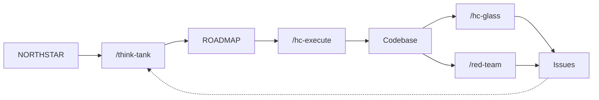

# PM Dashboard

**H-Claude** • Current Focus: *Workflow self-reviews complete*

---

## Commands

-   :material-head-lightbulb:{ .lg .middle } **[Plan](think-tank/index.md)**

    ---

    `/think-tank` convenes experts to map decisions and create execution plans.

-   :material-play-circle:{ .lg .middle } **[Execute](hc-execute/index.md)**

    ---

    `/hc-execute` runs phased implementation with Oraca orchestrators and QA gates.

-   :material-magnify:{ .lg .middle } **[Audit](hc-glass/index.md)**

    ---

    `/hc-glass` - Brutal codebase audit. Trust nothing, verify everything.

-   :material-shield-search:{ .lg .middle } **[QA/Review](red-team/index.md)**

    ---

    `/red-team` - Quality Seals. Compare docs vs reality, find drift.

---

## Project Status

| Field | Value |
|-------|-------|
| **Active Phase** | Foundation |
| **Status** | Workflow improvements |
| **Type** | Template |

### Recent Actions

| Date | Action |
|------|--------|
| 2026-01-04 | hc-execute self-review V2.9.0 (ADR-004) |
| 2026-01-04 | think-tank self-review V2.5.0 (ADR-003) |
| 2026-01-04 | Gauntlet Loop integration (ADR-002) |
| 2026-01-03 | Diffusion Development Philosophy |
| 2026-01-02 | Initial H-Claude structure |

## Quick Access

-   :material-compass: **[NORTHSTAR](SSoT/NORTHSTAR.md)**

    Goals & requirements

-   :material-map: **[ROADMAP](SSoT/roadmap-view.md)**

    Development phases

-   :material-format-list-checks: **[BACKLOG](backlog-view.md)**

    Deferred work

-   :material-cog: **[context.yaml](context-view.md)**

    Session state

### Resources

| Document | Purpose |
|----------|---------|
| [Agent Roles](SSoT/AGENT_ROLES.md) | Role definitions |
| [Changelog](CHANGELOG.md) | Version history |
| [Get Started](docs/GET_STARTED.md) | Installation |

---

## Active Sessions

| Type | Topic | Status | Path |
|------|-------|--------|------|
| think-tank | [hc_execute_self_review](think-tank/hc_execute_self_review_20260104/00_BRIEFING.md) | :material-check-circle:{ .green } decided | ADR-004 |
| think-tank | [think_tank_self_review](think-tank/think_tank_self_review_20260104/00_BRIEFING.md) | :material-check-circle:{ .green } decided | ADR-003 |
| think-tank | [agentic_framework](think-tank/agentic_framework_20260103/00_BRIEFING.md) | :material-check-circle:{ .green } decided | Diffusion |

---

## Workflow

**Agent Hierarchy:** Opus (strategy) → Pro (reasoning) → Flash (execution)

