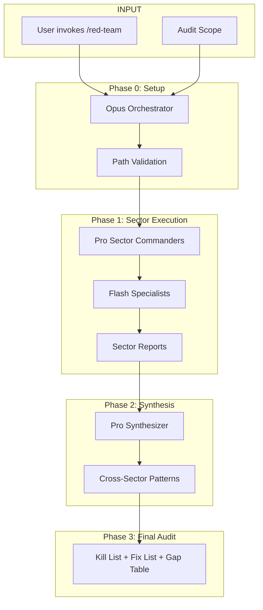

# Red Team

**Quality Seals Audit - Multi-layer deep-dive to find gaps, contradictions, and zombie artifacts.**

Trust but Verify. Assume 15% of documentation doesn't match reality.

---

## Recent Audits

| Date | Audit | Scope |
|------|-------|-------|
| *No audits yet* | - | - |

---

## How `/red-team` Works

---

## Audit Sectors

| Sector | Name | Focus |
|--------|------|-------|
| **1** | SSoT Integrity | Documentation vs reality, ADR compliance |
| **2** | Agent Architecture | Constitution compliance, role boundaries |
| **3** | API/Tool Contracts | Interface signatures, implementation gaps |
| **4** | Workflow Mechanics | State machines, transition validity |
| **5** | Resource Safety | Limits, cleanup, leak prevention |
| **6** | Error Handling | Recovery paths, failure modes |

---

## Scope Options

| Scope | Sectors | Use Case |
|-------|---------|----------|
| **full** | All 6 sectors | Comprehensive audit |
| **core** | Sectors 1-3 | Quick health check |
| **custom** | User-specified | Targeted investigation |

---

!!! tip "Running Audits"
    Run `/red-team` to execute a quality seals audit.
