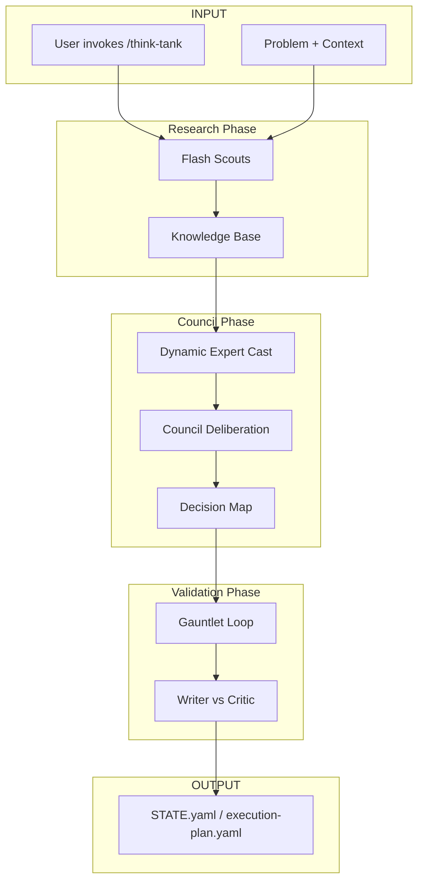

# Think Tank

**Council-based decision support - experts collaborate to map options and help you think.**

---

## Recent Sessions

| Date | Session | Status |
|------|---------|--------|
| 2026-01-04 | [Session Start Hooks](session_start_hooks_20260104/index.md) | Active |
| 2026-01-04 | [HC Folder Architecture](hc_folder_architecture_20260104/index.md) | Decided |
| 2026-01-04 | [HC System Prompt Design](hc_system_prompt_design_20260104/index.md) | Decided |
| 2026-01-04 | [hc-execute Self-Review](hc_execute_self_review_20260104/index.md) | Decided |
| 2026-01-04 | [Think-Tank Self-Review](think_tank_self_review_20260104/index.md) | Decided |
| 2026-01-04 | [Ralph Loop Integration](ralph_loop_integration_20260104/index.md) | Decided |
| 2026-01-03 | [Agentic Framework](agentic_framework_20260103/index.md) | Decided |

---

## How `/think-tank` Works

---

## Council Roles

| Role | Agent | Purpose |
|------|-------|---------|
| **Orchestrator** | Opus | Moderator, coordination |
| **Domain Expert** | Opus | Deep subject knowledge |
| **Pragmatist** | Pro | Guardian of resources |
| **Scouts** | Flash | Research facts, gather context |

---

## Gauntlet Loop Roles

| Role | Agent | Purpose |
|------|-------|---------|
| **Writer** | Opus | Defend the plan |
| **Critic** | Pro | Find breaks, edge cases |
| **Arbiter** | Flash | Rule on contested issues |

---

!!! tip "Creating New Sessions"
    Run `/think-tank "Your Topic"` to start a new council session.
