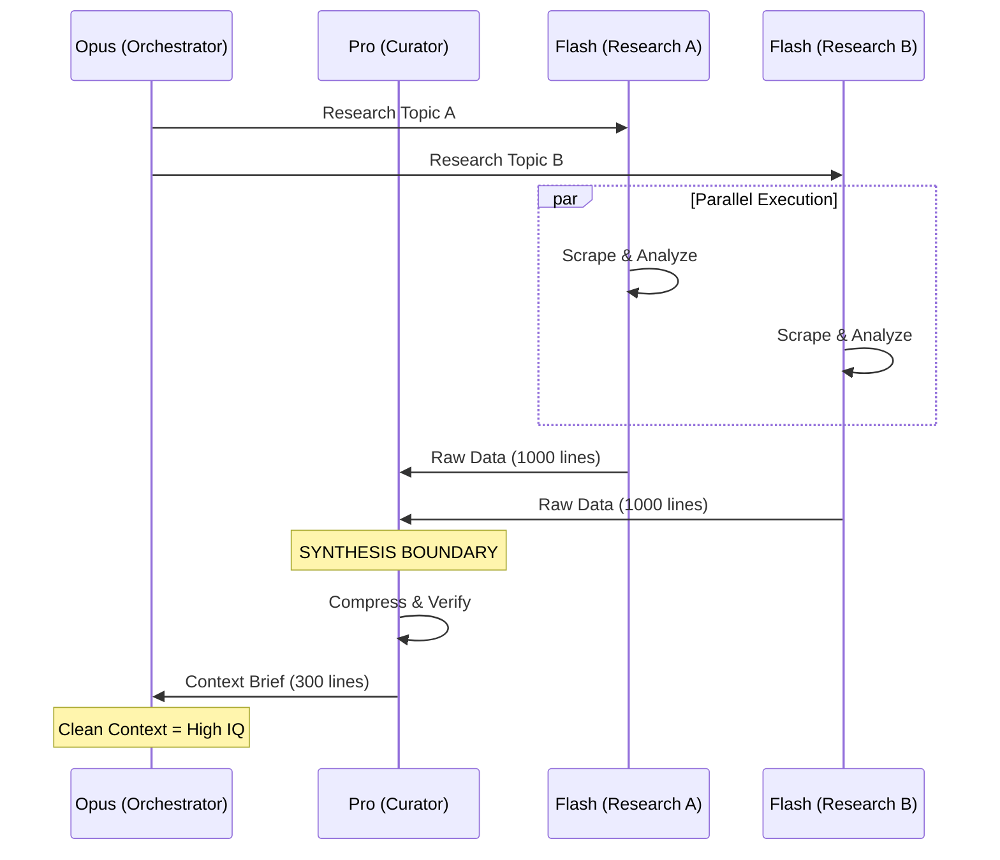

# Orchestration Patterns Guide

**Author:** HeyDude
**Problem Solved:** Context constraints kill quality. These patterns let us execute complex tasks without hitting context limits while maintaining high output quality.

---

## The Core Insight

Claude Code (HD) has limited context. When I try to do everything myself:
- Context fills up with research, intermediate steps, and noise
- Quality degrades as I lose track of earlier decisions
- I start making inconsistent choices
- Tasks get partially completed

The solution: **Hierarchical delegation with synthesis boundaries**.

---

## The Three-Tier Model

| Tier | Model | Role | Context Cost |
|------|-------|------|--------------|
| **Opus** | CC-Claude (2408) | Orchestrate, reason, synthesize finals | HIGH - preserve |
| **Pro** | CG-Pro (2406) | Coordinate, challenge, curate, QA | MEDIUM - reusable |
| **Flash** | CG-Flash (2405) | Research, execute, validate | LOW - disposable |

**Golden Rule:** Opus never reads raw output. Pro curates first.

---

## Pattern 1: Synthesis Before Reasoning

**Problem:** Research produces 4-6 files of raw data. If Opus reads them all, context is wasted on noise.

**Solution:** Pro synthesizes research into one curated brief.

```
Flash Researchers (parallel)     Pro Curator            Opus
        ↓                            ↓                    ↓
  R1_CODEBASE.md    ───┐
  R2_ADR_SSOT.md    ───┼──→   CONTEXT_BRIEF.md   ───→   Reads ONE doc
  R3_HISTORY.md     ───┤      (curated, 300 lines)      Reasons on clean data
  R4_EXTERNAL.md    ───┘
  (2000+ lines total)
```

**Sequence Diagram:**



**Implementation:**
```bash
# Phase 1: Flash researchers (parallel)
ANTHROPIC_API_BASE_URL=http://localhost:2405 claude --dangerously-skip-permissions -p "Research X, write to R1.md"
ANTHROPIC_API_BASE_URL=http://localhost:2405 claude --dangerously-skip-permissions -p "Research Y, write to R2.md"

# Phase 1.5: Pro synthesizes
ANTHROPIC_API_BASE_URL=http://localhost:2406 claude --dangerously-skip-permissions -p "Read R1-R4.md, write CONTEXT_BRIEF.md"

# Phase 2: Opus reasons on curated data
ANTHROPIC_API_BASE_URL=http://localhost:2408 claude --dangerously-skip-permissions -p "Read CONTEXT_BRIEF.md, produce plan"
```

**Used In:** `/hc-plan` (Phase 1.5), `/red-team` (Sector Synthesis)

---

## Pattern 2: Oraca Phase Orchestrators

**Etymology:** Oraca = "little orchestrator" (diminutive). A mini-orchestrator that owns one phase.

**Problem:** Plans with 15+ tasks overwhelm Opus. Each worker's output pollutes context.

**Solution:** Delegate phase ownership to Flash "Oraca" agents. Opus only sees phase summaries.

```
Opus Orchestrator
    ↓
    ├──→ Oraca[1] (Flash) ──→ Workers ──→ Phase QA (Pro) ──→ PHASE_1_REPORT.md
    │
    ├──→ Oraca[2] (Flash) ──→ Workers ──→ Phase QA (Pro) ──→ PHASE_2_REPORT.md
    │
    └──→ Oraca[3] (Flash) ──→ Workers ──→ Phase QA (Pro) ──→ PHASE_3_REPORT.md
                                                                    ↓
                                                            Opus reads summaries
```

**Why Flash for Oraca (not Pro)?**
- Phase orchestration is mechanical, not creative
- Flash is cheaper and faster
- Pro is better spent on QA reasoning

**Oraca Rules:**
1. Oraca owns ONE phase, writes to `PHASE_X/` folder
2. Oraca spawns Flash workers (max 3 parallel)
3. Oraca spawns Pro for Phase QA after all workers complete
4. Oraca reports status: `COMPLETE | PARTIAL | BLOCKED`
5. Oraca CANNOT spawn other Oraca (no recursion)

**Used In:** `/hc-execute` (Phase 2)

---

## Pattern 3: Adversarial Prior (The 15% Rule)

**Problem:** Optimism bias. We assume work is complete when workers say it's done.

**Solution:** Build in skepticism. Assume 15% is missing or wrong.

**Implementation Techniques:**

1. **Sweep Phase:** After all work, spawn a "15% Hunter" to compare plan vs result
2. **QA Gates:** Every phase boundary has Pro QA before proceeding
3. **Path Validation:** Before spawning agents, verify target paths exist
4. **Evidence Required:** Workers must produce artifacts, not just claim completion

```
Workers claim "DONE"
        ↓
   Phase QA (Pro) ── 15% prior → Rejects partial work
        ↓
   Sweeper (Pro) ── Compares plan to reality → Finds gaps
        ↓
   Fix Phase if needed
```

**Used In:** `/hc-execute` (Sweep Phase), `/red-team` (Sector validation)

---

## Pattern 4: Session Folders (Self-Contained Artifacts)

**Problem:** Artifacts scatter across the filesystem. Can't trace how we got to a decision.

**Solution:** One folder per session with structured subfolders.

```
.claude/PM/TEMP/${TASK_SLUG}_[TYPE]_Session/
├── ORCHESTRATOR_LOG.md       # Flight Recorder (append-only)
├── [PHASE_ARTIFACTS]/        # Intermediate work
├── ANALYSIS/                 # Synthesis and cross-cutting
└── [FINAL_OUTPUT].md         # Deliverable
```

**Session Types:**
| Type | Suffix | Purpose |
|------|--------|---------|
| Brainstorm | `_BS_Session` | Planning |
| Execution | `_EXEC_Session` | Implementation |
| Red Team | `_RT_Session` | Audit |

**Why This Works:**
- **Self-contained:** `mv folder/ archive/` moves everything
- **Traceable:** `grep` across session finds all context
- **Debuggable:** ORCHESTRATOR_LOG.md shows agent spawns and failures
- **Paired:** `feature_BS_Session/` produces plan, `feature_EXEC_Session/` executes it

---

## Pattern 5: Flight Recorder

**Problem:** Async agent output is chaos. When something fails, can't trace what happened.

**Solution:** Append-only event log in every session.

**Format:**
```
[TIMESTAMP] [EVENT_TYPE] Message with context
```

**Event Types:**
| Event | Meaning |
|-------|---------|
| `[INIT]` | Session started |
| `[SPAWN]` | Agent dispatched |
| `[COMPLETE]` | Agent returned |
| `[PHASE]` | Phase boundary crossed |
| `[WARN]` | Concerning pattern |
| `[CRITICAL]` | Circuit breaker / escalation |
| `[DONE]` | Session finished |

**Example:**
```
[2025-12-29T20:15:00Z] [INIT] Session initialized. Mode: Standard.
[2025-12-29T20:15:05Z] [SPAWN] Flash R1 (Codebase) dispatched
[2025-12-29T20:18:00Z] [COMPLETE] Flash R1 returned. 847 lines in R1_CODEBASE.md
[2025-12-29T20:25:00Z] [WARN] Phase 2 has blocked task. Continuing with Phase 3.
```

**Debug Uses:**
- `SPAWN→COMPLETE` never happened = agent stuck
- Many `WARN` events = weak plan
- `SPAWN×20` without progress = circuit breaker failed

---

## Pattern 6: Pro as Commander (Sector Pattern)

**Problem:** Opus can't directly manage many Flash agents without context pollution.

**Solution:** Pro "Commanders" coordinate domains. Opus talks to Commanders, not specialists.

```
Opus Orchestrator
    ↓
    ├──→ Pro Commander (Sector 1) ──→ Flash Specialist A
    │                              ──→ Flash Specialist B
    │                              ──→ SECTOR_1_REPORT.md
    │
    ├──→ Pro Commander (Sector 2) ──→ Flash Specialist C
    │                              ──→ Flash Specialist D
    │                              ──→ SECTOR_2_REPORT.md
    │
    └──→ Pro Synthesizer ──→ Reads all sector reports
                          ──→ SECTOR_SYNTHESIS.md
                                    ↓
                             Opus reads synthesis
```

**Pro Commander Responsibilities:**
1. Understand domain scope
2. Spawn appropriate Flash specialists (2-3)
3. Synthesize specialist findings into sector report
4. Flag concerns for Opus

**Used In:** `/red-team` (Sector Commanders)

---

## Pattern 7: Interface Contracts

**Problem:** Parallel workers build incompatible pieces. Integration fails.

**Solution:** Generate INTERFACES.md before spawning workers. All workers reference it.

```markdown
# INTERFACES.md

## Task A → Task B Contract
Task A produces: {id: string, status: 'active'|'done'}
Task B expects: exactly those keys

## File Ownership
- config.json: Created by Task 1, read by Tasks 2,3
- schema.sql: Created by Task 2, migrated by Task 5
```

**When to Use:**
- Any plan with parallel execution
- Cross-phase dependencies
- Shared data structures

**Used In:** `/hc-execute` (Phase 1: Contract generation)

---

## Pattern 8: The Circuit Breaker (Resilience)

**Problem:** Agents can get stuck in "Hallucination Loops" (e.g., trying to fix a file that doesn't exist, failing, and trying again forever).

**Solution:** Hard-coded stop limits on ALL iterative loops.

**The Three Guards:**

| Guard | Trigger | Action |
|-------|---------|--------|
| **3-Strike Rule** | Same task fails QA 3 times | Mark BLOCKED → Escalate to Human |
| **Token Ceiling** | Session exceeds X tokens without `[PHASE]` transition | ABORT session |
| **Duplicate Guard** | Worker proposes identical edit to previous rejection | HARD STOP |

**Implementation:**
```python
# Pseudocode for 3-Strike Rule
task_strikes = {}

def on_qa_rejection(task_id, reason):
    task_strikes[task_id] = task_strikes.get(task_id, 0) + 1

    if task_strikes[task_id] >= 3:
        log("[CRITICAL] Task {task_id} hit 3 strikes. Escalating.")
        mark_blocked(task_id)
        escalate_to_human(task_id, attempts=task_strikes[task_id])
        return STOP

    return RETRY
```

**Flight Recorder Signals:**
```
[WARN] Task T3 rejected. Strike 2/3.
[CRITICAL] Task T3 hit 3 strikes. Escalating to HD.
[CRITICAL] Session token ceiling reached. Aborting.
```

**Why This Matters:**
- LLMs are optimistic—they'll keep trying forever
- Loops waste tokens and time
- Human intervention beats infinite retry

**Used In:** `/hc-execute` (Worker Retry Loop), `/red-team` (Commander Timeout)

---

## Decision Matrix: When to Use Each Pattern

| Situation | Pattern | Why |
|-----------|---------|-----|
| Research before planning | Synthesis Before Reasoning | Don't pollute Opus with raw data |
| Plan has 10+ tasks | Oraca Phase Orchestrators | Phase isolation prevents context blowup |
| Critical feature | Adversarial Prior (15% Rule) | Catch what optimism misses |
| Multi-step workflow | Session Folders | Traceability and debugging |
| Any orchestration | Flight Recorder | Know what happened when it breaks |
| Audit or investigation | Pro as Commander | Domain expertise without Opus pollution |
| Parallel execution | Interface Contracts | Prevent integration debt |
| Any iterative loop | Circuit Breaker | Prevent infinite hallucination loops |
| Background agents | Stall Detection Protocol | Detect hung agents, escalate gracefully |

---

## Anti-Patterns to Avoid

### 1. Opus Does Everything
**Wrong:** Opus reads 10 files, spawns 20 workers, tracks all tasks.
**Right:** Opus delegates to Pro/Oraca, reads synthesized summaries.

### 2. No Synthesis Layer
**Wrong:** Flash produces research → Opus reads it directly.
**Right:** Flash produces research → Pro curates → Opus reads brief.

### 3. Trusting Worker Claims
**Wrong:** Worker says "done" → Mark task complete.
**Right:** Worker says "done" → QA verifies → Sweeper hunts gaps → Then complete.

### 4. Scattered Artifacts
**Wrong:** Write outputs wherever convenient.
**Right:** All session artifacts in one `_Session/` folder.

### 5. Silent Failures
**Wrong:** Agent spawned, never heard from again.
**Right:** Flight Recorder logs every spawn and completion.

### 6. No Circuit Breakers
**Wrong:** Worker fails → Retry → Fails → Retry → Forever.
**Right:** 3 strikes → BLOCKED → Escalate to Human.

---

## Quick Reference: Proxy Commands

```bash
# Flash (research, workers, Oraca)
ANTHROPIC_API_BASE_URL=http://localhost:2405 claude --dangerously-skip-permissions -p "..."

# Pro (synthesis, QA, commanders, challengers)
ANTHROPIC_API_BASE_URL=http://localhost:2406 claude --dangerously-skip-permissions -p "..."

# Opus (orchestration, high-value reasoning)
ANTHROPIC_API_BASE_URL=http://localhost:2408 claude --dangerously-skip-permissions -p "..."
```

---

## Pattern 9: Stall Detection Protocol

**Problem:** Background agents can hang indefinitely with no visibility. Without heartbeats, orchestrators can't tell if agents are working or stuck.

**Solution:** Agents write heartbeat files. Orchestrator polls for activity. 3-level escalation on stall.

```
┌─────────────────────────────────────────────────────────────┐
│  STALL DETECTION PROTOCOL                                    │
├─────────────────────────────────────────────────────────────┤
│                                                              │
│  1. SPAWN: Agent writes HEARTBEAT_${ID}.md on start         │
│     → Agent updates heartbeat every 2-3 min while working   │
│                                                              │
│  2. POLL: Orchestrator checks after task_timeout:           │
│     → Check HEARTBEAT mtime                                 │
│     → Check session log file growth                         │
│     → Check git diff (code-producing tasks only)            │
│                                                              │
│  3. ESCALATION LADDER (if no activity detected):            │
│     → Level 1: NUDGE - Write to COMMANDS.md                 │
│     → Level 2: RESPAWN - Kill and spawn fresh               │
│     → Level 3: ESCALATE - Alert HD                          │
│                                                              │
└─────────────────────────────────────────────────────────────┘
```

**Stall Check Interval:**

**Check every 5 minutes** regardless of task type. If no heartbeat update in 5 minutes, begin escalation.

| Type | Expected Duration | Check Interval |
|------|-------------------|----------------|
| `QUICK` | ~5 min | 5 min |
| `STANDARD` | ~10 min | 5 min |
| `RESEARCH` | ~20 min | 5 min |
| `ORCHESTRATION` | 30+ min | 5 min |

**Key:** Check interval is ALWAYS 5 minutes. Expected duration is for reference only.

**HEARTBEAT File Format:**

```markdown
# Agent Heartbeat
agent: Oraca[0]
task: Phase 0 execution
started: 2025-12-30T10:00:00Z
last_beat: 2025-12-30T10:08:00Z
status: WORKING
current_action: Reading ADR files for context
```

**Escalation Ladder:**

| Level | Trigger | Action | Log Event |
|-------|---------|--------|-----------|
| **NUDGE** | No heartbeat for `timeout` | Write `[NUDGE]` to agent's COMMANDS.md | `[STALL] Level 1: Nudging agent` |
| **RESPAWN** | 2 min after nudge, still stalled | Kill process, spawn fresh with same task | `[STALL] Level 2: Respawning agent` |
| **ESCALATE** | Respawn fails or times out | Log critical, alert HD | `[CRITICAL] Agent stalled. Escalating.` |

**Implementation:**

```bash
# Sub-agent writes heartbeat on start and updates every 2-3 minutes
write_heartbeat() {
    cat > "${SESSION_PATH}/HEARTBEAT_${AGENT_ID}.md" << EOF
agent: ${AGENT_ID}
started: ${START_TIME}
last_beat: $(date -Iseconds)
status: WORKING
current_action: ${CURRENT_ACTION}
EOF
}

# Orchestrator checks for stall after spawning
check_stall() {
    HEARTBEAT_FILE="${SESSION_PATH}/HEARTBEAT_${AGENT_ID}.md"
    if [ -f "$HEARTBEAT_FILE" ]; then
        LAST_MODIFIED=$(stat -c %Y "$HEARTBEAT_FILE")
        NOW=$(date +%s)
        DELTA=$((NOW - LAST_MODIFIED))

        if [ $DELTA -gt $TIMEOUT_SECONDS ]; then
            log_event "[STALL] No heartbeat for ${DELTA}s from ${AGENT_ID}"
            return 1  # Stall detected
        fi
    fi
    return 0  # Agent active
}
```

**Flight Recorder Signals:**
```
[STALL] Level 1: Nudging Oraca[0] after 310s silence
[STALL] Level 2: Respawning Oraca[0] after nudge timeout
[CRITICAL] Oraca[0] stalled after respawn. Escalating to HD.
```

**Why This Matters:**
- LLMs can get stuck in loops or hang on API calls
- Without heartbeats, orchestrators wait forever
- Escalation ladder prevents both false positives (nudge first) and infinite waits (eventual escalate)

**Used In:** All orchestration commands (`/hc-execute`, `/hc-plan`, `/hc-glass`, `/init-sim`, `/red-team`)

---

## The Orchestration Mantras

**Brainstorming:**
```
I understand before I research.
I curate before I reason.
Better Data = Better Thinking.
```

**Execution:**
```
I parse phases before I execute.
I delegate to Oraca, not workers.
I verify at phase boundaries.
Trust but Verify.
```

**Audit:**
```
I validate paths before I spawn.
I compare docs to reality.
I synthesize before I conclude.
```

---

## Related Documents

| Document | Purpose |
|----------|---------|
| [hc-plan.md](commands/hc-plan.md) | Dialectic planning command |
| [hc-execute.md](commands/hc-execute.md) | SWEEP & VERIFY execution command |
| [red-team.md](commands/red-team.md) | Quality Seals Audit command |
| [ADR-1201](../../PM/SSoT/ADRs/1201-functional-agent-roster.md) | Agent roles and layers |

---

**Last Updated:** 2025-12-30
**Version:** V1.2.0
**Author:** HeyDude
